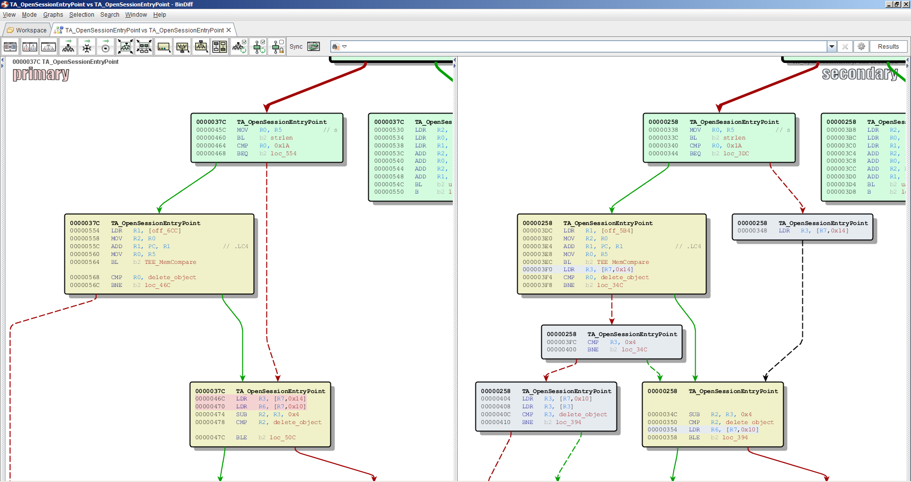
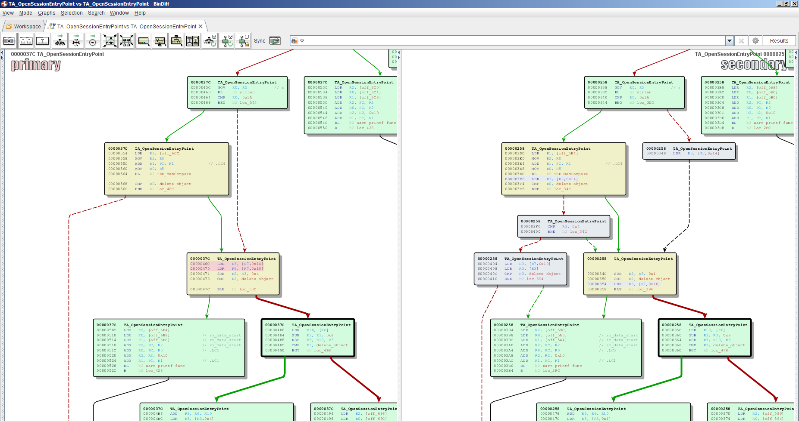
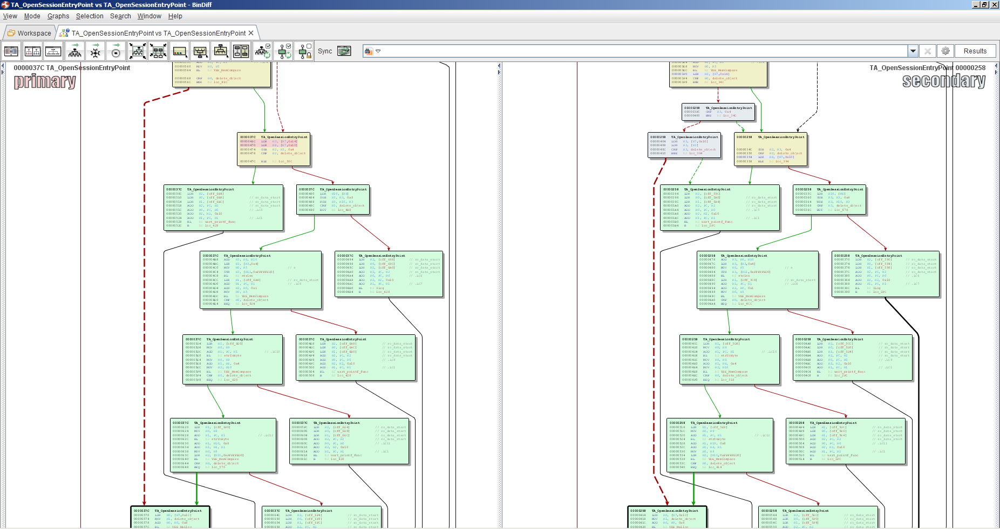

## Setup

```
$ pip install -r requirements.txt
$ ln -s /path/to/cle/ cle_orig
$ patch < angr-8.19.10.30.patch
```

## Get Binaries

* [xda-developers.com](https://forum.xda-developers.com/huawei-p9lite)
* [huaweidl.com](https://huaweidl.com/download/p9-lite/vns-l31/)

## How to

In this section, we will give a brief overview, how we imagine the use of SimTA.

The use-case is the following:
We have two versions of a TrustCore Trusted Application as binaries (one version and the patch to this version) and
 we want to analyze the TA in regard to 1-day-vulnerabilities.
We assume that the patched version of the binary has fixed a security flaw and therefore we are analyzing the parts of the binaries that differ between both versions.
To get these sections we generate a binary-diff using Zynamics bindiff tool, which is an extension to the IDA dissassembler.

Then the analysis consists of severel steps:
 * First, we need to know, what inputs we have to feed into the TA to reach the previously received parts in the binary.
 * Second, we want to know, whether there is user-controlled input being processed in these sections, since we definitely won't find vulnerabilities, there is n user-controlled input processed.
 * Third, we want to know, if these patched code sections introduce some security relevant checks.
To do so, we read the addresses of the code blocks, that follow the patched code as well as the corresponding address in the unpatched binary (Zynamic's bindiff shows these blocks).
From the second step we know what user-input might be affected, so we selectively set these inputs to symbolic values and execute both versions of the TA to the following blocks we just got from the bindiff.
When we reach the desired addresses, we can easily compare the resulting constraints on our symbolic inputs and should see from the difference in the constraints between the two binaries, if the constraints could indicate securityrelevant checks.

## Example
We will go through a short example, to show, how SimTA is used to perform the analysis process from above.

The screenshot below shows, how Zynamic's bindiff shows the differences between two versions of a binary file.
The grey blocks on the right side are the blocks, that have been introduced in the patched version and are the ones we want to analyze further in our investigation.


### Find inputs with symbolic execution
Therefore, the first thing we want to do, is find out, what inputs to the TA will lead execution to these blocks.
To do this, we take a naive approach and set all our input parameters to symbolic values.
This will lead SimTA to a crash in most cases, but with the crash, SimTA will give us some information about what went wrong, so we can adjust our inputs for the next run and should get closer to the desired locations step by step.

For our example, we would like to reach the addresses `0x3FC`, `0x404` and `0x348`.
To start SimTA with symbolic values in order to reach these addresses, we use the following command:
```
python -m simta.simta exec binaries/task_storage_160 0x158c binaries/globaltask.elf exec.securestorage.lifecycleallsymbolic.SecureStorageLifecycleAllSymbolic 0x3fc 0x404 0x348
```
In this case, we run into an error at the first call to strlen, but the error, which looks like below, tells us, where the program crashed an what parameters to adjust.
(In this case, we crashed in the block at `0x338` and the problematic parameter is `param_a_opensession_3_14_32`, which basically refers to `params[3].a` from the params array which is the input for the call to opensession)
```buildoutcfg
----------[ ERROR ]---------

strlen got the following symbolic inputs: ['Inputstring: <SAO <BV32 param_a_opensession_3_14_32>>']
Backtrace:
Frame 0: 0x119e338 => 0x2000010, sp = 0x11bacf0
Frame 1: 0x119f700 => 0x119e258, sp = 0x11bae28
Frame 2: 0x0 => 0x0, sp = 0xffffffff
```

So we change the corresponding parameter to a symbolic parameter with the type `MEMREF_INPUT`.
These specifications are made in the corresponding `lifecycleXYZ.py`-file, which holds a SecureStorageLifecycle class where the inputs can be specified.

When we run SimTA again, with the adjustet parameter, we will reach `0x348` and can see from the constraints (`self.show_constraints()`), that `strlen(param3_buf)` needs to return something different to `0x1a`, so we need to insert a string with a length not equal to 26 to reach this address.
To find out, how to reach the other addresses, we can just continue the execution of SimTA and see, if we find a way to the other breakpoints.

Indeed SimTA stops at `0x3fc` and we can see from either the constraints or a call to `self.solve_symbolics()`, that we would have to use the string `b'/system/bin/tee_test_store'` as our input.

If we continue the execution one more time, we will also reach the last breakpoint at `0x404` and the constraints will tell us, that `param_b_opensession_2_12_32` needs to be equal to `0x4` in order to reach this address.

### Taint tracking with patched code
Now we can easily check these addresses for the occurrence of user-input, since we know how to reach each of these blocks.

Therefore we need to adjust our `lifecycleallsymbolic.py`-file with the concrete values to reach these blocks and afterwards execute SimTA in `filter`-mode to check a whole block for the occurrence of user-input.

First we want to check the block at `0x348`, so we just use an input string with a `length != 0x1a`, e.g. `'test'`.
For the `filter`-mode, we need to tell SimTA the start and the end of each basic block we want to check, so the corresponding call will look like this:
```buildoutcfg
python -m simta.simta filter binaries/task_storage_160 0x14c8 binaries/globaltask.elf exec.securestorage.lifecycleallsymbolic.SecureStorageLifecycleAllSymbolic 0x348 0x348
```
The output will look like this, and we can see, that `param_b_opensession_2` was loaded to r3 in this block:
```buildoutcfg
Tainted values that appear in block from 0x348 to 0x348:
	['0x344', 0, 'r0', 'param3_ptr', 'before block']
	['0x344', 0, 'r5 -> 0xc8020460', 'param3_buf_open_session', 'before block']
	['0x344', 0, 'r7', 'params_struct_pointer', 'before block']
	['0x344', 0, 'r7 -> 0xc8020000', 'param_a_opensession_0', 'before block']
	['0x348', 0, 'r3', 'param_b_opensession_2', 'in block']
Tainted values that are used in this block:
	['0x348', 'r7', '0x119e348:  ldr  r3, [r7, #0x14]']
	['0x348', 'r3', '0x119e348:  ldr  r3, [r7, #0x14]']
```
 The rows with the annotation `'before block` tell, that these values have been in the registers before the desired block was reached, so they are only relevant, if they occurr in the second table, where the values that do not just appear in the registers or the referenced memory, but also in the code within this block.

For the other blocks we need to set the input string to `b'/system/bin/tee_test_store'` and again execute SimTA in `filter`-mode with the correct start and end addresses for the blocks
(we can set `param_b_opensession_2` to `0x4` and treat the code from `0x3fc` to `0x410` as one block here).
The result looks like the following and we can see, that `param2_buf_opensession` and `param2_len_opensession` are user-controlled values that are processed here.
```buildoutcfg
Tainted values that appear in block from 0x3fc to 0x410:
	['0x3f8', 0, 'r2', 'param3_ptr', 'before block']
	['0x3f8', 0, 'r3', 'param2_len_open_session', 'before block']
	['0x3f8', 0, 'r5 -> 0xc8020460', 'param3_buf_open_session', 'before block']
	['0x3f8', 0, 'r7', 'params_struct_pointer', 'before block']
	['0x3f8', 0, 'r7 -> 0xc8020000', 'param_a_opensession_0', 'before block']
	['0x404', 0, 'r3', 'param2_ptr', 'in block']
	['0x404', 0, 'r3 -> 0xc8020340', 'param2_buf_open_session', 'in block']
Tainted values that are used in this block:
	['0x3fc', 'r3', '0x119e3fc:  cmp  r3, #4']
	['0x404', 'r3', '0x119e404:  ldr  r3, [r7, #0x10]']
	['0x404', 'r7', '0x119e404:  ldr  r3, [r7, #0x10]']
	['0x408', 'r3', '0x119e408:  ldr  r3, [r3]']
	['0x40c', 'r3', '0x119e40c:  cmp  r3, #0']
```

### Compare constraints between the two versions
To compare the constraints in the following blocks, we user Zynamic's bindiff to identify the corresponding blocks in the both versions (see image):



(We don't care about the blocks that end up in calling `uart_printf_func`, since these blocks indicate errors)

Now we need to adjust our inputs and set the values we found with the `filter`-mode to symbolic values and stop execution in these following blocks in both binaries.
For the block at `0x348` the commands and the interesting outputs would look like this:
```buildoutcfg
patched version:
python -m simta.simta exec binaries/task_storage_160 0x158c binaries/globaltask.elf exec.securestorage.lifecycleallsymbolic.SecureStorageLifecycleAllSymbolic 0x35c

unpatched version:
python -m simta.simta exec binaries/task_storage_130 0x14c8 binaries/globaltask.elf exec.securestorage.lifecycleallsymbolic.SecureStorageLifecycleAllSymbolic 0x480
```
The resulting constraints at the breakpoint show some checks on the `param_types` and `param_b_opensession_2`, but the checks appear in both versions, so there did not happen too much in the patch.

Doing the same for the other blocks will reveal an additional constraint in the patched binary, indeed!
The constraint looks like this : `<Bool Reverse(param2_buf_opensession_14_2048[2047:2016]) == 0x0>` and basically tells us, that the first 32 bits of `param2_buf_opensession` needs to be zero.

With this information, the analyst can reason about the relevance of the patch in regard to system security.

The process is pretty much straight forward and the same for all the blocks that appear in the binary-diff.


## Limitations
 * For analyzing different TAs, the corresponding SimProcedures need to be implemented
 * At the moment, the lifecycle of the program flow needs to be given by the analyst (see SecureStorageLifecycle classes)
